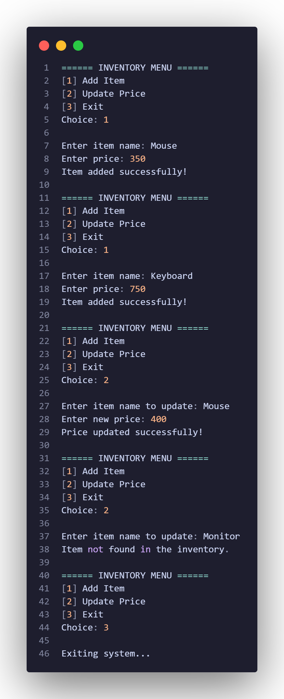

# Assignment for Programming Languages CS15L(4404)

## Activity Title
**Activity 1 - Python Inventory System**

## Problem Description
This program implements an inventory management system using Python that allows users to manage items and their prices.

## Sample output

## Author
``Oclarit, Jan Vincent``

## Screenshot of running program

